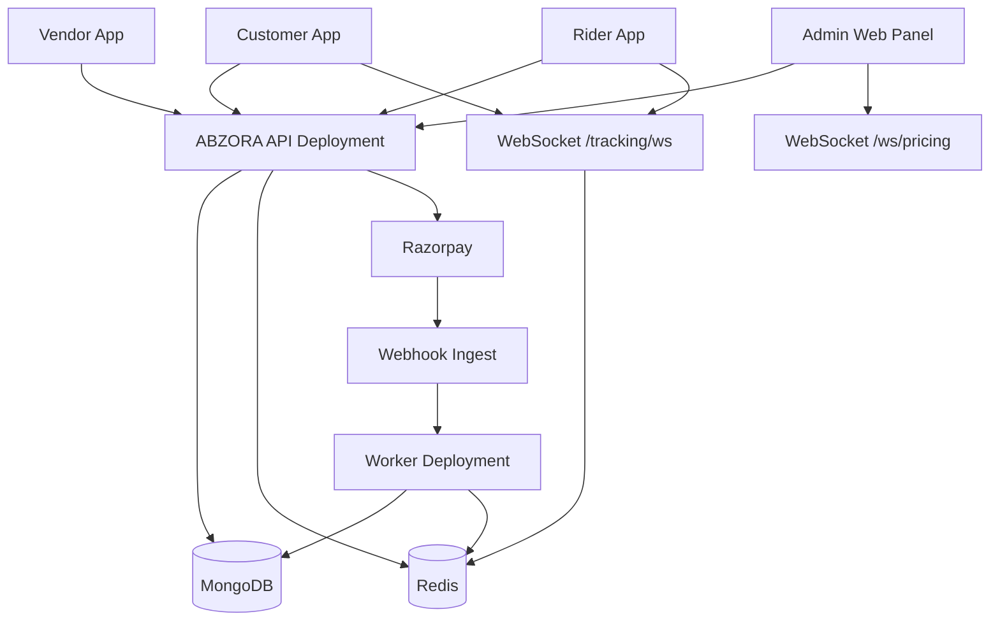
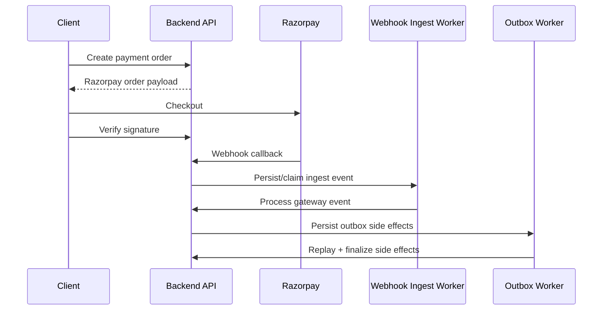
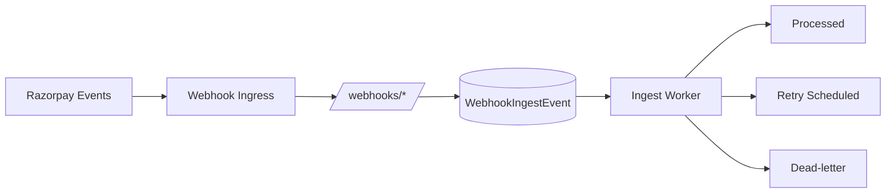
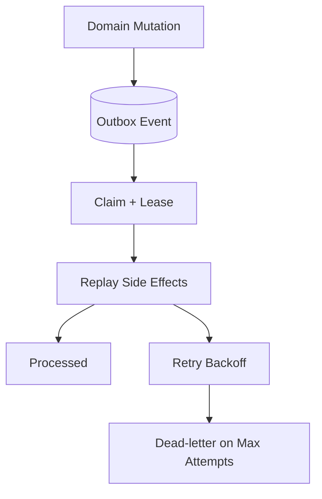
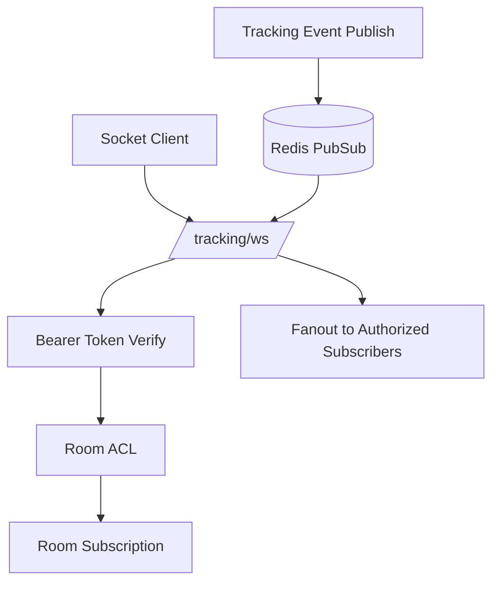
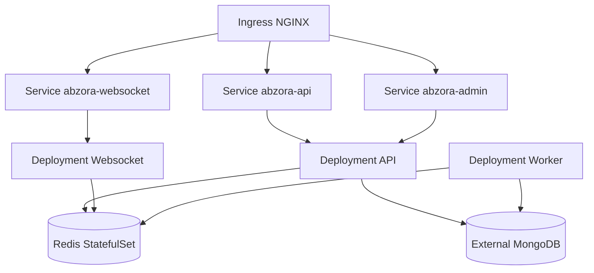
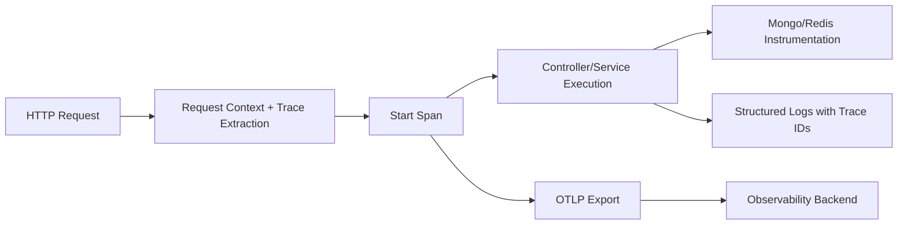

# Architecture Diagrams

## System Architecture

```mermaid
graph TD
  C[Customer App] --> API[ABZORA API Deployment]
  V[Vendor App] --> API
  R[Rider App] --> API
  A[Admin Web Panel] --> API
  C --> WS[WebSocket /tracking/ws]
  R --> WS
  A --> PWS[WebSocket /ws/pricing]
  API --> MDB[(MongoDB)]
  API --> REDIS[(Redis)]
  WS --> REDIS
  W[Worker Deployment] --> MDB
  W --> REDIS
  API --> RP[Razorpay]
  RP --> WH[Webhook Ingest]
  WH --> W
```

## Payment Flow

```mermaid
sequenceDiagram
  participant App as Client
  participant API as Backend API
  participant RP as Razorpay
  participant IG as Webhook Ingest Worker
  participant OB as Outbox Worker

  App->>API: Create payment order
  API-->>App: Razorpay order payload
  App->>RP: Checkout
  App->>API: Verify signature
  RP->>API: Webhook callback
  API->>IG: Persist/claim ingest event
  IG->>API: Process gateway event
  API->>OB: Persist outbox side effects
  OB->>API: Replay + finalize side effects
```

## Webhook Ingest Flow

```mermaid
graph LR
  RP[Razorpay Events] --> IN[Webhook Ingress]
  IN --> API[/webhooks/*/]
  API --> EVT[(WebhookIngestEvent)]
  EVT --> WKR[Ingest Worker]
  WKR --> OK[Processed]
  WKR --> RET[Retry Scheduled]
  WKR --> DLQ[Dead-letter]
```

## Queue / Outbox Flow

```mermaid
graph TD
  DOM[Domain Mutation] --> OUT[(Outbox Event)]
  OUT --> C[Claim + Lease]
  C --> REPLAY[Replay Side Effects]
  REPLAY --> DONE[Processed]
  REPLAY --> RETRY[Retry Backoff]
  RETRY --> DLQ[Dead-letter on Max Attempts]
```

## WebSocket Event Flow

```mermaid
graph TD
  CL[Socket Client] --> G[/tracking/ws/]
  G --> AUTH[Bearer Token Verify]
  AUTH --> ACL[Room ACL]
  ACL --> RM[Room Subscription]
  PUB[Tracking Event Publish] --> REDIS[(Redis PubSub)]
  REDIS --> G
  G --> FO[Fanout to Authorized Subscribers]
```

## Kubernetes Topology

```mermaid
graph TD
  ING[Ingress NGINX] --> APISVC[Service abzora-api]
  ING --> WSSVC[Service abzora-websocket]
  ING --> ADMSVC[Service abzora-admin]
  APISVC --> APIPOD[Deployment API]
  WSSVC --> WSPOD[Deployment Websocket]
  ADMSVC --> APIPOD
  APIPOD --> REDIS[(Redis StatefulSet)]
  WSPOD --> REDIS
  WRK[Deployment Worker] --> REDIS
  APIPOD --> MDB[(External MongoDB)]
  WRK --> MDB
```

## OTEL Trace Flow

```mermaid
graph LR
  REQ[HTTP Request] --> CTX[Request Context + Trace Extraction]
  CTX --> SP[Start Span]
  SP --> APP[Controller/Service Execution]
  APP --> DB[Mongo/Redis Instrumentation]
  APP --> LOG[Structured Logs with Trace IDs]
  SP --> EXP[OTLP Export]
  EXP --> OBS[Observability Backend]
```
